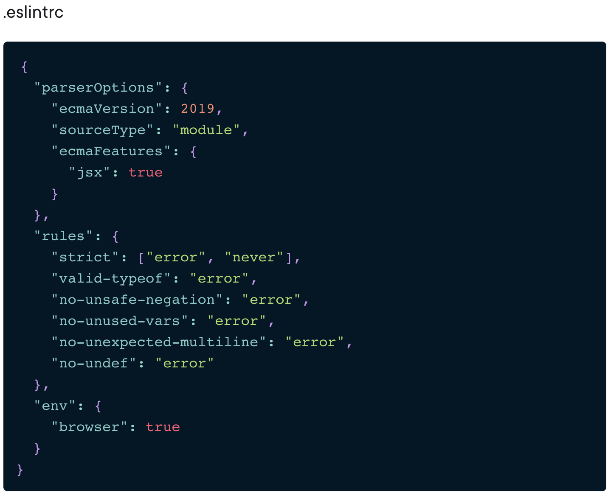

# ESLINT Configuration

```js
	// This will install ESLINT
	npm install --save-dev eslint
	// This will run ESLINT accross all files
	npx eslint .

    // This will auto-fix rules that are automatically fixable:
    npmx eslint . --fix
```
This is an example of a .eslintrc file:


## Prettier
    npm install --save-dev prettier
    npx prettier src/somefile.js
    npx prettier --write src/somefile.js

In order to create a `script`, add in the `package.json` file:

    "format": "prettier --write \"**/*.+(js|json|ts|tsx")\""

We can add the flag to also ignore the .gitignore file:

    "format": "prettier --write --ignore-path .gitignore \"**/*.+(js|json|ts|tsx")\""

## ESLint Config Prettier

    npm install --save-dev eslint-config-prettier

## Typescript
    npm install --save-dev typescript
### Configuration
Create a `tsconfig.json` file, once the json file is configured you can run:

    npx tsc

## Typescript ESLint

    npm install --save-dev @typescript-eslint/eslint-plugin @typescript-eslint/parser

## Husky
    npm install --save-dev husky

## Lint Staged

    npm install --save-dev lint-staged

Create a configuration file: `.lintstagedrc`